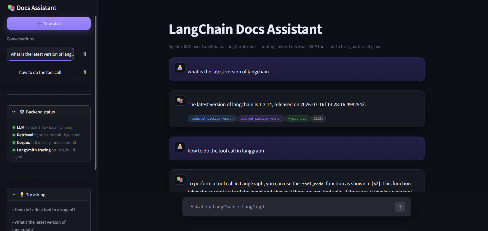
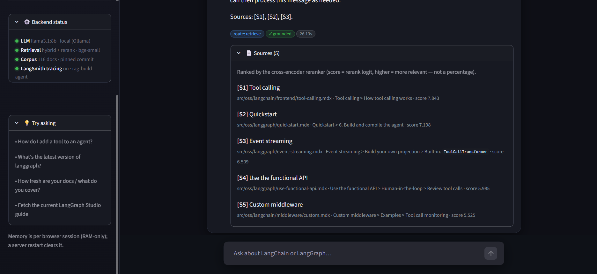
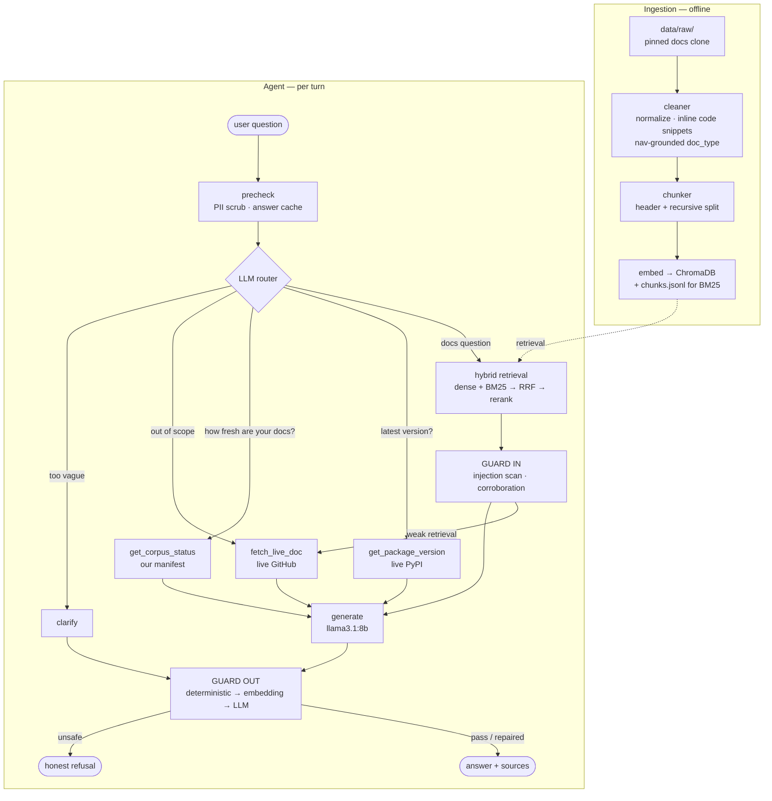

# Enterprise Support Knowledge Assistant

An **agentic RAG system** over the LangChain / LangGraph documentation — built to
demonstrate production RAG engineering, not a "chat with your docs" demo.

It routes each question to the right strategy, retrieves with a hybrid
dense + sparse pipeline, calls live tools when the frozen corpus can't answer,
and puts every generated answer through a two-stage guard layer that **repairs
what it can and refuses what it must**.

Runs entirely **locally and free**: `llama3.1:8b` via Ollama, local embeddings,
local vector store. No paid API is required to run it.

---

## Demo

### 1. Agentic routing — the system picks a live tool over its own index



Two turns are visible, and they take **different paths through the graph**:

- **"what is the latest version of langchain"** → the corpus is pinned to a fixed
  commit, so retrieval *physically cannot* know today's release. The router
  recognises this and calls the `get_package_version` MCP tool, which hits the
  live PyPI API. The badges record the decision:
  `route: get_package_version` · `tool: get_package_version` · `✓ grounded` · `18.26s`.
- **"how to do the tool call in langgraph"** → a genuine documentation question,
  so this one goes to hybrid retrieval and is answered from the indexed chunks
  with a `[S2]` citation.

**Why it matters:** this is the line between a RAG pipeline and an **agent**. A
plain RAG system would confidently answer the version question from a stale
document. This one reasons about *what kind* of question it received, recognises
the boundary of its own knowledge, and reaches outside for live data.

**Also visible in this shot:**
- **Conversation history rail** (left) — every chat is listed, switchable and
  deletable, auto-named from its first message. Each conversation id *is* the
  LangGraph `thread_id`, so each keeps its own independent multi-turn memory.
- **Backend status panel** — live state of the running system: local LLM
  (`llama3.1:8b` via Ollama), the retrieval stack (hybrid + rerank, bge-small),
  corpus size (116 docs at a pinned commit), and LangSmith tracing status.
- **Per-answer badges** — route taken, tool used, guard verdict, and latency, on
  every single turn.

### 2. Inspectable retrieval — every citation is traceable



The **Sources** panel expands to show exactly which chunks the answer was built
from — each with its **file path, section heading, and cross-encoder rerank
score**, ordered by relevance:

| | source | score |
|---|---|---|
| `[S1]` | `src/oss/langchain/frontend/tool-calling.mdx` → *How tool calling works* | 7.843 |
| `[S2]` | `src/oss/langgraph/quickstart.mdx` → *Build and compile the agent* | 7.198 |
| `[S3]` | `src/oss/langgraph/event-streaming.mdx` → *Build your own projection* | 6.509 |
| `[S4]` | `src/oss/langgraph/use-functional-api.mdx` → *Review tool calls* | 5.985 |
| `[S5]` | `src/oss/langchain/middleware/custom.mdx` → *Tool call monitoring* | 5.525 |

The `[S#]` markers in the answer text map directly to these rows, so any claim
can be checked against the document it came from.

**Why it matters:** retrieval quality is **auditable rather than asserted**. You
can see whether the reranker actually surfaced relevant material, and the scores
are shown as raw rerank logits — deliberately *not* dressed up as a percentage,
because a cross-encoder logit isn't one. The badge row (`route: retrieve` ·
`✓ grounded` · `26.13s`) shows the guard layer's verdict on this specific answer.

---

## What makes it more than a RAG demo

| Capability | How |
|---|---|
| **Agentic routing** | An LLM router picks one of 5 paths: retrieve · package version · corpus status · live doc fetch · clarify |
| **Hybrid retrieval** | dense (bge-small + Chroma) + BM25 → Reciprocal Rank Fusion → cross-encoder rerank |
| **Real MCP tools** | A FastMCP server exposing 3 tools that return **real** data (live PyPI, our own manifest, live GitHub docs) — no mock data |
| **Knows its own limits** | The corpus is pinned to a commit, so "what's the latest version?" routes to PyPI, and out-of-scope topics escalate to a live fetch |
| **Two-stage guardrails** | Input: PII scrub, prompt-injection scan, source corroboration. Output: deterministic → embedding → LLM checks |
| **Measured, not asserted** | Every number below comes from a committed eval harness, including 3 **held-out** attack suites |
| **Observability + caching** | LangSmith tracing (auto region detection) and three in-process caches |

---

## Results

All measured against the shipped system with the committed harnesses in `eval/`.

### Retrieval — `python -m eval.run_eval` (91 questions)

| metric | dense | hybrid + rerank |
|---|---|---|
| Recall@5 | 0.868 | 0.861 |
| Hit@5 | 0.890 | 0.890 |
| MRR | 0.760 | 0.760 |

> **Honest reading:** the two are indistinguishable *on this corpus*. 116 clean,
> single-domain docs with auto-generated paraphrase-style questions is exactly
> the setting where dense alone does fine. Hybrid earns its keep on larger,
> noisier, identifier-heavy corpora — revisiting that is a tracked follow-up.

### Answer quality — `python -m eval.ragas_eval` (RAGAS, LLM-judged)

| metric | dense | hybrid + rerank | **agent (guarded)** |
|---|---|---|---|
| Faithfulness | 0.835 | 0.809 | **0.719** |
| ResponseRelevancy | 0.929 | 0.956 | **0.851** |
| ContextPrecision | 0.647 | 0.682 | **0.663** |

> The guarded agent scores *lower* on faithfulness by design: a refusal is
> "unfaithful to context" by construction, so the ~10% of questions it safely
> declines drag the mean down. Reported honestly that's **~0.79 on answered
> questions at a 0.099 refusal rate.**

### Safety — `python -m eval.eval_injections` (3 disjoint suites, 105 attacks)

| | before guards | after |
|---|---|---|
| Attack success (when the poisoned chunk was retrieved) | 0.333 | **0.040** |
| False refusals on 91 legitimate questions | 0.440 | **0.099** |
| Routing accuracy (Jaccard, 22 cases) | — | **0.932** |

> Suites **B** and **C** are held out — written *after* the guards, with disjoint
> attacks, markers and probes. Suite A alone scored 0.0, which turned out to
> measure the guards against the very strings they were built from. The held-out
> suites immediately found 4 real defects, including an answer that told the user
> to paste a leaked API key into an attacker-controlled portal.
>
> **2 of 50 attacks still land.** Both are single-source misinformation — a false
> claim with no competing value anywhere in the corpus, so majority-vote
> corroboration has nothing to count. That's a threat-model boundary (the real
> fix is provenance control at ingestion), not something a regex should paper over.

---

## Architecture



The MCP tools run in a **separate process** over stdio; the agent holds one warm
session for its lifetime.

---

## Quickstart

### Prerequisites
- Python 3.11+
- [Ollama](https://ollama.com) running locally: `ollama pull llama3.1:8b`
- ~6 GB VRAM (or CPU, slower)

### 1. Install
```bash
git clone <this-repo> && cd rag_build
python -m venv env
./env/Scripts/python.exe -m pip install -r requirements.txt   # Windows
# source env/bin/activate && pip install -r requirements.txt  # macOS/Linux
```

### 2. Get the corpus
The source docs are **not vendored** (they're a 1.1 GB clone of another MIT
project). Fetch them at the pinned commit:

```bash
git clone https://github.com/langchain-ai/docs.git data/raw
cd data/raw && git checkout 22cbff9d7ad4b676db836360d98adc343f523ee1 && cd ../..
```

### 3. Configure
```bash
cp .env.example .env      # then fill in what you need
```
Everything except the LLM is optional — see `.env.example`.

### 4. Build the index
```bash
./env/Scripts/python.exe -m ingestion.cleaner.run     # data/raw  → data/cleaned
./env/Scripts/python.exe -m ingestion.run             # cleaned   → chunks.jsonl
./env/Scripts/python.exe -m ingestion.embed_and_store # chunks    → ChromaDB
```
> Re-running only reprocesses changed files. If you change the *pipeline* rather
> than the *source*, pass `--force`.

### 5. Run it
```bash
# Web UI (recommended)
./env/Scripts/python.exe -m streamlit run app/streamlit_app.py

# or terminal chat
./env/Scripts/python.exe -m agent.cli
```

---

## Reproducing the evaluations

```bash
./env/Scripts/python.exe -m eval.run_eval                                   # retrieval metrics
./env/Scripts/python.exe -m eval.eval_routing                               # routing accuracy
./env/Scripts/python.exe -m eval.ragas_eval                                 # RAGAS + false-refusal rate
./env/Scripts/python.exe -m eval.eval_injections --phase a --suite b        # regex coverage
./env/Scripts/python.exe -m eval.eval_injections --phase b --suite b --add  # end-to-end attacks
```
> The injection harness temporarily poisons the corpus and always purges in a
> `finally`. RAGAS needs a `GEMINI_API_KEY` (a *different* model judges, so the
> answerer can't grade itself).

---

## Project layout

```
agent/        LangGraph agent — graph, nodes, router, guards, cache, tracing
  guards/     two-stage guardrails (check_input / check_output)
retrieval/    dense · sparse · RRF fusion · cross-encoder rerank
ingestion/    cleaner (MDX → Markdown) · chunker · embedder
  cleaner/    detector · normalizer · filter · manifest
mcp_server/   FastMCP server exposing the 3 real-data tools
app/          Streamlit UI + async runtime bridge
eval/         all evaluation harnesses + committed results
docs/         roadmap and phase-by-phase build notes
```

---

## Tech stack

**LangGraph** (orchestration) · **LangChain** (retrieval utils) · **ChromaDB** ·
**bge-small-en-v1.5** (embeddings) · **rank-bm25** ·
**ms-marco-MiniLM-L-6-v2** (reranker) · **llama3.1:8b** via Ollama ·
**MCP Python SDK** · **RAGAS** · **LangSmith** · **Streamlit**

---

## Design decisions worth calling out

- **Code examples are never dropped.** Many pages keep code in Mintlify snippet
  imports rendered as `<Component />`. The cleaner inlines those *before*
  stripping JSX — otherwise exactly the code a code-focused retriever needs would
  vanish. Restoring it also moved hybrid retrieval **+0.12 MRR**, because BM25
  finally had identifiers to match on.
- **`doc_type` comes from the docs' own navigation**, not guessed from paths. A
  content-density classifier was tried and abandoned (it collapsed 83/114 docs
  into one class).
- **Guards repair before they refuse.** An all-or-nothing verifier was discarding
  95%-correct answers over one unsupported sentence.
- **The eval corpus includes deliberate noise** — off-topic and poisoned chunks —
  so "it ignores junk" is measured, not assumed.

---

