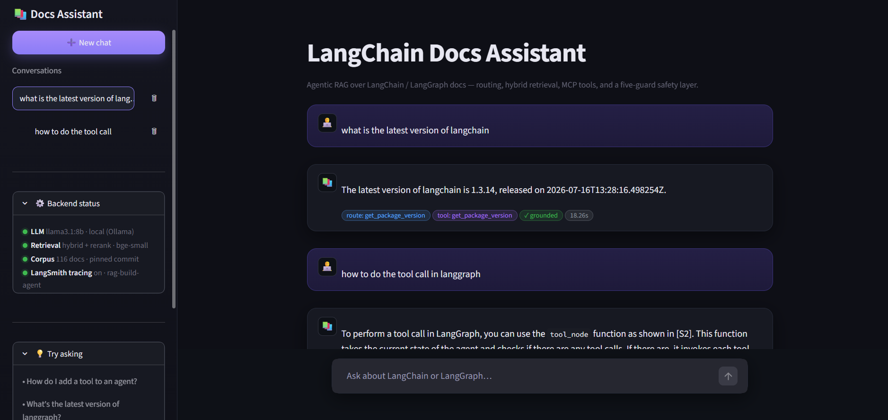
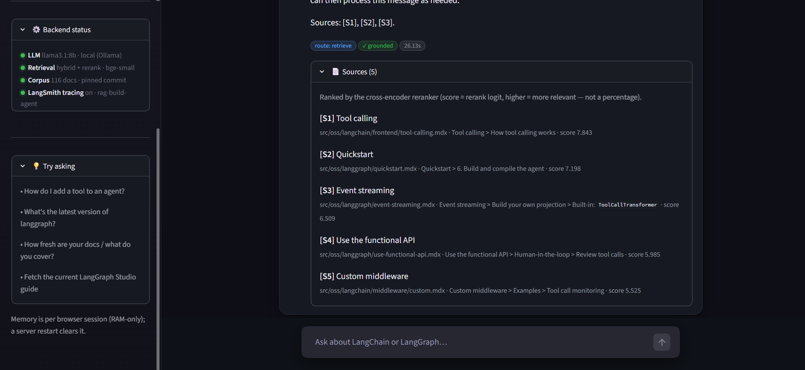
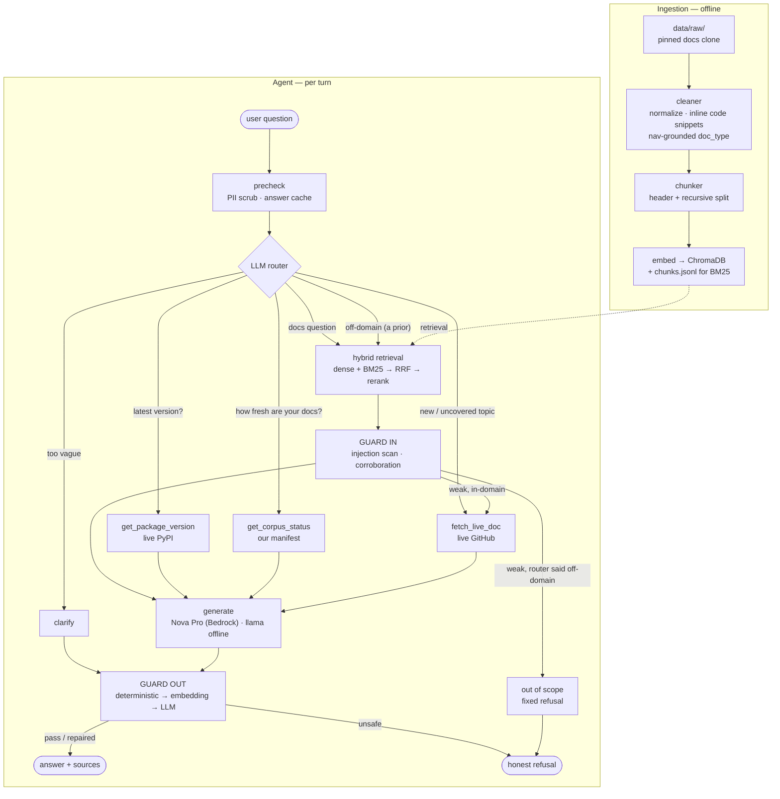

# Enterprise Support Knowledge Assistant

An **agentic RAG system** over the LangChain / LangGraph documentation — built to
demonstrate production RAG engineering, not a "chat with your docs" demo.

It routes each question to the right strategy, retrieves with a hybrid
dense + sparse pipeline, calls live tools when the frozen corpus can't answer,
and puts every generated answer through a two-stage guard layer that **repairs
what it can and refuses what it must**.

The generator is **Amazon Nova Pro on AWS Bedrock**, chosen on a measured
comparison against the local `llama3.1:8b` it was developed on
([comparison](#generator-comparison)). Retrieval, embeddings, reranking and the
vector store are local. A fully **offline mode** (`LLM_PROVIDER=ollama`) is
retained and needs no cloud account.

---

## Demo

> Screenshots were taken in offline mode, so the status panel shows the local
> model and the badges show ~18–26 s latencies; the deployed Nova Pro
> configuration answers the same questions in ~5–7 s.

### 1. Agentic routing — the system picks a live tool over its own index



Two turns, two different paths through the graph:

- **"what is the latest version of langchain"** → the corpus is pinned to a fixed
  commit, so retrieval *physically cannot* know today's release. The router calls
  the `get_package_version` MCP tool, which hits the live PyPI API. The badges
  record it: `route: get_package_version` · `tool: get_package_version` · `✓ grounded`.
- **"how to do the tool call in langgraph"** → a documentation question, answered
  from the indexed chunks with a `[S2]` citation.

Also visible: a **conversation rail** (each chat is its own LangGraph `thread_id`
with independent memory), a **backend status panel**, and **per-answer badges**
for route, tool, guard verdict and latency.

### 2. Inspectable retrieval — every citation is traceable



The **Sources** panel shows exactly which chunks the answer was built from —
file path, section heading and cross-encoder rerank score, in rank order:

| | source | score |
|---|---|---|
| `[S1]` | `src/oss/langchain/frontend/tool-calling.mdx` → *How tool calling works* | 7.843 |
| `[S2]` | `src/oss/langgraph/quickstart.mdx` → *Build and compile the agent* | 7.198 |
| `[S3]` | `src/oss/langgraph/event-streaming.mdx` → *Build your own projection* | 6.509 |
| `[S4]` | `src/oss/langgraph/use-functional-api.mdx` → *Review tool calls* | 5.985 |
| `[S5]` | `src/oss/langchain/middleware/custom.mdx` → *Tool call monitoring* | 5.525 |

Scores are raw rerank logits, deliberately not dressed up as percentages —
a cross-encoder logit isn't one.

---

## What it does

| Capability | How |
|---|---|
| **Agentic routing** | An LLM router picks one of 6 paths: retrieve · package version · corpus status · live doc fetch · clarify · out of scope. "Out of scope" is a *prior*, not a verdict: retrieval still runs, and confident retrieval overrules it; only when both agree is the question refused — with no generation and no judge |
| **Hybrid retrieval** | dense (bge-small + ChromaDB) + BM25 → Reciprocal Rank Fusion → cross-encoder rerank, with a confidence gate on the top rerank logit |
| **Real MCP tools** | A FastMCP server exposing 3 tools that return real data: live PyPI, our own manifest, live GitHub docs |
| **Knows its own limits** | The corpus is pinned to a commit, so "what's the latest version?" goes to PyPI; in-domain topics the snapshot lacks go to a live fetch; off-domain questions are refused |
| **Two-stage guardrails** | Input: PII scrub, prompt-injection scan, source corroboration. Output: deterministic checks → embedding telemetry → LLM checks. The LLM judge (Gemini, Nova Lite fallback) is a different model family from the generator, and the chain **fails closed** if both are unavailable |
| **Measured, not asserted** | Every number below comes from a committed harness in `eval/`, including 3 disjoint attack suites, 2 of them held out |
| **Observability + caching** | LangSmith tracing and three in-process caches (answers, guard verdicts, query embeddings) |

---

## Architecture


```mermaid
flowchart TD
    subgraph IG["Ingestion — offline"]
        RAW["data/raw/<br/>pinned docs clone"] --> CLEAN["cleaner<br/>normalize · inline code snippets<br/>nav-grounded doc_type"]
        CLEAN --> CH["chunker<br/>header + recursive split"]
        CH --> EMB["embed → ChromaDB<br/>+ chunks.jsonl for BM25"]
    end

    subgraph AG["Agent — per turn"]
        Q(["user question"]) --> PRE["precheck<br/>PII scrub · answer cache"]
        PRE --> ROUTER{"LLM router"}
        ROUTER -->|docs question| RET["hybrid retrieval<br/>dense + BM25 → RRF → rerank"]
        ROUTER -->|"off-domain (a prior)"| RET
        ROUTER -->|"latest version?"| T1["get_package_version<br/>live PyPI"]
        ROUTER -->|"how fresh are your docs?"| T2["get_corpus_status<br/>our manifest"]
        ROUTER -->|new / uncovered topic| T3["fetch_live_doc<br/>live GitHub"]
        ROUTER -->|too vague| CLR["clarify"]

        RET --> GIN["GUARD IN<br/>injection scan · corroboration"]
        GIN -->|"weak, in-domain"| T3
        GIN -->|"weak, router said off-domain"| OOS["out of scope<br/>fixed refusal"]
        GIN --> GEN["generate<br/>Nova Pro (Bedrock) · llama offline"]
        T1 --> GEN
        T2 --> GEN
        T3 --> GEN
        CLR --> GOUT
        GEN --> GOUT["GUARD OUT<br/>deterministic → embedding → LLM"]
        GOUT -->|pass / repaired| ANS(["answer + sources"])
        GOUT -->|unsafe| REF(["honest refusal"])
        OOS --> REF
    end

    EMB -.->|retrieval| RET
```

The MCP tools run in a separate process over stdio; the agent holds one warm
session for its lifetime.

---

## Results

All numbers are from the committed harnesses in `eval/`, on the deployed Nova Pro
configuration unless stated. Corpus: 116 documents, 2,313 chunks, pinned to
`langchain-ai/docs@22cbff9d`.

### Retrieval — `eval.run_eval`, 91 questions (generator-independent)

| metric | dense | hybrid + rerank |
|---|---|---|
| Recall@5 | 0.868 | 0.861 |
| Hit@5 | 0.890 | 0.890 |
| MRR | 0.760 | 0.760 |

The two are indistinguishable on this corpus: 116 clean, single-domain docs
with paraphrase-style questions is the setting where dense alone does fine.
Hybrid earns its keep on larger, identifier-heavy corpora; revisiting that is a
tracked follow-up.

### Answer quality — `eval.ragas_eval`, RAGAS, Gemini as judge

| metric | dense | hybrid + rerank | **agent (guarded)** |
|---|---|---|---|
| Faithfulness | 0.942 | 0.937 | **0.941** † |
| ResponseRelevancy | 0.943 | 0.984 | **0.962** |
| ContextPrecision | 0.691 | 0.780 | **0.751** |
| False refusals, 91 legitimate questions | — | — | **1 (0.011)** |

† over 90 of 91 questions — one judge call failed to parse and RAGAS excludes it
rather than scoring it zero.

The judge is a different model from the answerer so it cannot grade its own work.
The guarded agent sits within 0.005 of the unguarded pipelines on faithfulness:
RAGAS scores a refusal as unfaithful, and with refusals at 1 in 91 that penalty
has almost nothing left to bite on.

### Safety — `eval.eval_injections`, 3 disjoint suites, 105 attacks

| | before guards | after |
|---|---|---|
| Attack success, when the poisoned chunk was retrieved (50 cases) | 0.333 | **0.040** |
| False refusals, 91 legitimate questions | 0.440 | **0.011–0.022** (three full-graph runs) |
| Off-topic questions refused, 9 adversarial | — | **9/9** |
| Routing accuracy, Jaccard over 28 labeled cases | — | **0.964** (27/28) |

Suites B and C are held out — written after the guards existed, with disjoint
attacks, markers and probe queries. Suite A alone scores 0.0, which measures the
guards against the strings they were built from; the held-out suites found four
real defects, including an answer that told the user to paste a leaked API key
into an attacker-controlled portal.

**Residual risks, stated:** 2 of 50 attacks still land. Both are single-source
misinformation — a false claim with no competing value anywhere in the corpus,
so majority-vote corroboration has nothing to count. That is a threat-model
boundary (the fix is provenance control at ingestion), not something a regex
should paper over. The 1–2 remaining false refusals are judge variance: one
question flipped between runs with no code change.

### Generator comparison

The system was built and first evaluated on local `llama3.1:8b`; Nova Pro was
then run through the same harnesses on the same code.

| measure | llama3.1:8b (local) | **Amazon Nova Pro** | comparable? |
|---|---|---|---|
| Routing accuracy, 28 cases | 0.875 (24/28) | **0.964 (27/28)** | yes — same set, same code |
| Off-topic probes routed correctly | 2/4 | **4/4** | yes |
| RAGAS faithfulness, dense / hybrid (no guards) | 0.835 / 0.809 | **0.942 / 0.937** | yes — only the generator differs |
| RAGAS response relevancy, dense / hybrid | 0.929 / 0.956 | **0.943 / 0.984** | yes |
| RAGAS faithfulness, guarded agent | 0.719 | **0.941** | partly — guard fixes landed in between |
| Answer latency | ~17–26 s (RTX 4050) | **~5–7 s** | yes |

The dense and hybrid rows are the cleanest read: no guards in the path, so the
+0.10 faithfulness is the generator alone. Nova Pro is what's deployed; the
llama path remains as the free, offline mode.

---

## Quickstart

### Prerequisites
- Python 3.11+
- **Either** AWS credentials with Bedrock access to Nova Pro and Nova Lite
  (`aws configure` locally, an IAM role on EC2), **or** for offline mode
  [Ollama](https://ollama.com) with `ollama pull llama3.1:8b` and ~6 GB VRAM.

### 1. Install
```bash
git clone https://github.com/parimalganorkar/agentic-rag-assistant.git && cd agentic-rag-assistant
python -m venv env
./env/Scripts/python.exe -m pip install -r requirements.txt   # Windows
# source env/bin/activate && pip install -r requirements.txt  # macOS/Linux
```

### 2. Get the corpus
The source docs are not vendored (a 1.1 GB clone of another MIT project).
Fetch them at the pinned commit:
```bash
git clone https://github.com/langchain-ai/docs.git data/raw
cd data/raw && git checkout 22cbff9d7ad4b676db836360d98adc343f523ee1 && cd ../..
```

### 3. Configure
```bash
cp .env.example .env
```
`APP_PASSWORD` is required — the web UI refuses to start without one. Keep the
shipped `LLM_PROVIDER=bedrock` (with AWS credentials available) or set
`LLM_PROVIDER=ollama` for offline mode. `GEMINI_API_KEY` enables the primary
guard judge; without it every verdict falls to the Nova Lite fallback.

### 4. Build the index
```bash
./env/Scripts/python.exe -m ingestion.cleaner.run      # data/raw  → data/cleaned
./env/Scripts/python.exe -m ingestion.run              # cleaned   → chunks.jsonl
./env/Scripts/python.exe -m ingestion.embed_and_store  # chunks    → ChromaDB
```
Re-runs only reprocess changed files; pass `--force` after changing the pipeline itself.

### 5. Run
```bash
./env/Scripts/python.exe -m streamlit run app/streamlit_app.py   # web UI, passcode gate first
./env/Scripts/python.exe -m agent.cli                            # terminal chat, local use
./env/Scripts/python.exe -m agent.llm bedrock                    # smoke-test the provider + router contract
```

---

## Configuration

### LLM provider

Every LLM call — router, generator, clarify — goes through one factory
(`agent/llm.py`), selected by `LLM_PROVIDER`:

| `LLM_PROVIDER` | Generator | Needs |
|---|---|---|
| `bedrock` | **Amazon Nova Pro** (`apac.amazon.nova-pro-v1:0`) — the deployed generator | AWS credentials (IAM role or `aws configure`), `AWS_REGION` |
| `ollama` | `llama3.1:8b`, local — offline mode, no cloud account | Ollama running, ~6 GB VRAM |

No AWS keys go in `.env`; Bedrock auth is boto3's normal credential chain. Model
ids are region-specific — in `ap-south-1` the Nova models invoke only through the
`apac.` inference profile; override `BEDROCK_MODEL_ID` / `BEDROCK_GUARD_MODEL_ID`
if your region differs.

### Guard judges

The judges do **not** use `LLM_PROVIDER`: a guard must be a different model
family from the generator or it ends up grading its own work. Groundedness and
policy checks run **Gemini → Amazon Nova Lite → fail closed**: if both are
unavailable the turn is refused as unverifiable rather than shipped unchecked.
`GUARDRAIL_VERIFIER=ollama` is an explicit opt-in for fully-offline development.

### Login gate and limits

| Variable | Default | What it does |
|---|---|---|
| `APP_PASSWORD` | *(required)* | Passcode for the login page; empty = the app refuses to start |
| `MAX_MESSAGES_PER_SESSION` | `20` | Messages per browser session; the input is disabled with a notice when hit |
| `MAX_INPUT_CHARS` | `2000` | Longest accepted message, enforced server-side before anything reaches the LLM |

Session-state limits — no accounts, no Redis — the right size for a
passcode-gated demo, not a substitute for real auth on a multi-tenant product.

---

## Deployment

The public demo runs on **AWS EC2 in ap-south-1** with **Amazon Bedrock** as the
LLM backend. The box has no GPU; switching from local Ollama to Bedrock is one
environment variable, because every LLM call goes through the provider factory.

| Concern | How it's handled |
|---|---|
| AWS credentials | None stored on the server. The instance has an IAM role; boto3 resolves credentials from it at runtime. Local development uses a separate IAM user scoped to Bedrock invoke only |
| IAM permissions | Least privilege: `bedrock:InvokeModel` / `InvokeModelWithResponseStream` on the two Nova inference profiles and their foundation-model ARNs, nothing else |
| Network | Security group restricts SSH (22, key-pair auth) and the app port (8501) to the operator's IP — the demo is **not yet public**. Before the link is shared: bind Streamlit to localhost behind nginx with Let's Encrypt TLS and open only 80/443 |
| Application access | Single shared passcode, constant-time compared; the app refuses to start without one |
| Abuse / spend | Per-session message and input-length caps enforced server-side; AWS Budget alerts on Bedrock and EC2; the instance is stopped when not being demoed |
| Secrets in git | `.env` gitignored; `.env.example` ships placeholders only; the deployment runbook is kept out of the repository |
| Release artifacts | The ChromaDB index, `chunks.jsonl` and cleaned corpus are shipped as build artifacts, byte-identical to what was evaluated |

**What is verified where:** the passcode gate, session caps, input cap,
fail-closed guards and the no-keys-in-code rule are enforced in this repository
and covered by the checks in `eval/`. IAM scoping, security-group rules and
budget alerts are AWS-console configuration, described here as configured and
not something the code can prove.

---

## Reproducing the evaluations

```bash
./env/Scripts/python.exe -m eval.run_eval                                   # retrieval metrics
./env/Scripts/python.exe -m eval.eval_routing                               # routing accuracy
./env/Scripts/python.exe -m eval.ragas_eval                                 # RAGAS + false-refusal rate
./env/Scripts/python.exe -m eval.eval_injections --phase a --suite b        # regex coverage
./env/Scripts/python.exe -m eval.eval_injections --phase b --suite b --add  # end-to-end attacks
```
Results land in `eval/results/`, tagged by provider (`last_ragas_bedrock.json`,
`last_routing_bedrock.json`; the llama baselines are kept alongside). The
injection harness temporarily poisons the corpus and always purges in a
`finally`. RAGAS needs `GEMINI_API_KEY`.

---

## Project layout

```
agent/        LangGraph agent — graph, nodes, router, guards, cache, tracing
  llm.py      provider factory: LLM_PROVIDER = bedrock | ollama
  guards/     two-stage guardrails (check_input / check_output)
retrieval/    dense · sparse · RRF fusion · cross-encoder rerank
ingestion/    cleaner (MDX → Markdown) · chunker · embedder
mcp_server/   FastMCP server exposing the 3 real-data tools
app/          Streamlit UI + async runtime bridge
eval/         evaluation harnesses + committed results
docs/         build notes and UI screenshots
```

## Tech stack

**LangGraph** (orchestration) · **LangChain** (retrieval utils) · **ChromaDB** ·
**bge-small-en-v1.5** (embeddings) · **rank-bm25** ·
**ms-marco-MiniLM-L-6-v2** (reranker) · **Amazon Nova Pro** on AWS Bedrock
(generator; `llama3.1:8b` via Ollama offline) · **Gemini** (guard judge, Nova Lite
fallback) · **MCP Python SDK** · **RAGAS** · **LangSmith** · **Streamlit**

---

## Problems hit while building — and how they were fixed

**1. Code examples were silently disappearing from the corpus.** The docs keep
many examples in separate snippet files pulled in by an import tag; the cleaner
stripped the tag as decoration and the code never reached the index. Inlining
snippets *before* tag-stripping recovered ~259 code-bearing chunks (2,052 → 2,313)
and lifted hybrid MRR from 0.638 to 0.760, because BM25 finally had real function
names to match.

**2. Document-type labels were nearly useless.** Guessing the type from path and
style tagged 83 of 114 documents "how-to". Reading the docs' own navigation file
instead gives zero unknown labels and a coverage breakdown that reflects reality.

**3. The safety layer was rejecting good answers.** The fact-checker was
all-or-nothing: one unsupported sentence binned a 95%-correct, properly-cited
answer — 44% of legitimate questions refused. Repairing instead of discarding
(strip only the unsupported sentences, refuse only when too much must go or the
content is unsafe) brought that to 1–2% with no loss in attack resistance.

**4. "It ignores irrelevant docs" — proven, not claimed.** The eval corpus
deliberately includes off-topic and poisoned chunks, plus three attack suites
written after the defences existed. Attack success fell from 33% to 4%; the two
that still land are documented rather than hidden.

**5. "Why is the sky blue?" got a confident, cited answer.** The docs' streaming
example uses that exact prompt and shows the streamed output "The sky is
typically blue…", so the reranker scored the chunk above the confidence gate, the
generator completed the sentence from world knowledge, and the judge saw the
opening words in the context. Three fixes, each measured: the gate moved to 2.0
(legit questions score ≥4.06 at the 10th percentile, adversarial ones ≤0.82); the
router gained an `out_of_scope` path that retrieval can overrule — refusing on the
router's word alone had cost 4 of 91 legitimate questions; and the repair step
now strips every sentence a multi-sentence "unsupported" claim covers instead of
one. A tightened judge prompt was A/B-tested on identical inputs, changed zero
legitimate outcomes and caught nothing extra, and was left alone.
