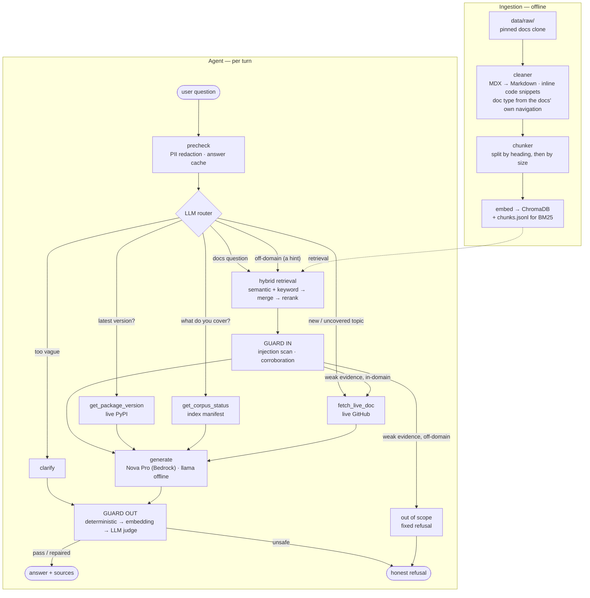

# Enterprise Support Knowledge Assistant

An **agentic RAG system** over the LangChain / LangGraph documentation — built to
demonstrate production RAG engineering, not a "chat with your docs" demo.

Documentation changes fast and a search index over it goes stale. This assistant
knows *what kind* of question it has been asked and *where its own knowledge
ends*: it answers documentation questions from a local index, reaches out to live
sources (PyPI, GitHub) when the frozen index cannot know the answer, refuses
questions that are not about LangChain at all, and passes every generated answer
through a two-stage safety layer that **repairs what it can and refuses what it
must** — with a citation for every claim.

The answer-writing model is **Amazon Nova Pro on AWS Bedrock**, chosen on a
measured comparison against the local `llama3.1:8b` it was developed on
([comparison](#generator-comparison)). Everything else — embeddings, retrieval,
reranking, the vector store — runs locally. A fully **offline mode**
(`LLM_PROVIDER=ollama`) is retained and needs no cloud account.

---

## Demo

> Screenshots were taken in offline mode, so the status panel shows the local
> model and the badges show ~18–26 s latencies; the deployed Nova Pro
> configuration answers the same questions in ~5–7 s.

### 1. The assistant picks a live tool over its own index


Two questions, two different paths:

- **"what is the latest version of langchain"** — the indexed docs are frozen at
  a fixed commit, so the index *cannot* know today's release. The assistant
  recognises this and calls a tool that queries the live PyPI API. The badges
  under the answer record the decision: `route: get_package_version` ·
  `tool: get_package_version` · `✓ grounded`.
- **"how to do the tool call in langgraph"** — an ordinary documentation
  question, answered from the index with a `[S2]` citation.

Also visible: a **conversation rail** on the left (each chat keeps its own
memory), a **backend status panel**, and **per-answer badges** showing the route
taken, the tool used, the safety verdict and the latency.

### 2. Every citation is traceable


The **Sources** panel lists the exact passages the answer was built from — file,
section, and the reranker's relevance score, best first:

| | source | score |
|---|---|---|
| `[S1]` | `src/oss/langchain/frontend/tool-calling.mdx` → *How tool calling works* | 7.843 |
| `[S2]` | `src/oss/langgraph/quickstart.mdx` → *Build and compile the agent* | 7.198 |
| `[S3]` | `src/oss/langgraph/event-streaming.mdx` → *Build your own projection* | 6.509 |
| `[S4]` | `src/oss/langgraph/use-functional-api.mdx` → *Review tool calls* | 5.985 |
| `[S5]` | `src/oss/langchain/middleware/custom.mdx` → *Tool call monitoring* | 5.525 |

The scores are the reranker's raw output, shown as-is rather than dressed up as
percentages, because they aren't percentages.

---

## How a question is answered

1. **Pre-check.** API keys or emails in the question are redacted before the text
   goes anywhere. If the same question (in the same conversation) was answered
   recently, the cached answer is returned and nothing below runs.
2. **Route.** A small LLM call classifies the question into one of six paths:
   a documentation question, a package-version question, a question about the
   assistant's own coverage, a request for a page the index doesn't have, a
   question too vague to act on, or a question that isn't about LangChain at all.
3. **Retrieve or call a tool.** Documentation questions go to hybrid retrieval:
   semantic search and keyword search run side by side over 2,313 passages, their
   rankings are merged, and a second model re-scores the top 20 to pick the best 5.
   The other paths call one of three tools over the Model Context Protocol (MCP)
   — a standard way to expose tools to an agent — each returning real data.
4. **Check the evidence before writing.** Retrieved passages are scanned for
   prompt-injection text and dropped if found. When passages disagree on a fact,
   the value backed by more independent documents wins and the outlier is dropped.
   If the best passage scores below a confidence threshold, the assistant either
   fetches the current page live from GitHub (in-domain topic the index lacks) or
   refuses (the router also called it off-domain) — it never answers from junk.
5. **Generate.** The model writes an answer from the surviving passages only,
   citing each as `[S1]`, `[S2]`, …
6. **Check the answer.** Cheap deterministic checks first (fabricated citations,
   duplicated sentences, dangerous instructions, APIs the docs never mention);
   then an independent LLM judge asks whether every claim is supported by the
   passages and whether anything in the answer serves someone other than the
   user. Unsupported sentences are removed; the answer is refused only if it is
   unsafe or nothing substantive survives.

Every path ends at one node that writes the final message into conversation
memory, so a rejected draft never lands in the history next to its replacement.

---

## What it does

| Capability | How |
|---|---|
| **Agentic routing** | An LLM router picks one of 6 paths. The "not about LangChain" verdict is treated as a hint, not a decision: retrieval still runs, and if the docs clearly cover the topic the hint is overruled; only when both agree is the question refused — with no generation and no judge |
| **Hybrid retrieval** | Semantic search (bge-small embeddings in ChromaDB) + keyword search (BM25), merged by Reciprocal Rank Fusion, re-scored by a cross-encoder, with a confidence threshold on the top score |
| **Real MCP tools** | Three tools that return real data: the current version of a package from PyPI, what the indexed docs cover and how old they are (from the index's own manifest), and a current documentation page fetched from GitHub |
| **Knows its own limits** | The index is pinned to a commit, so "what's the latest version?" goes to PyPI, an in-domain topic the snapshot lacks goes to a live fetch, and an off-domain question is refused |
| **Two-stage guardrails** | Before the model: PII redaction, prompt-injection scan, cross-document corroboration. After: deterministic checks → an LLM judge from a *different* model family than the writer (Gemini, with Amazon Nova Lite as fallback). If both judges are unavailable the answer is refused rather than passed unchecked |
| **Measured, not asserted** | Every number below comes from a committed harness in `eval/`, including attack suites written *after* the defences existed so they could not be tuned against |
| **Observability + caching** | LangSmith tracing of every node, and three in-process caches (answers, judge verdicts, query embeddings) |

---

## Architecture


```mermaid
flowchart TD
    subgraph IG["Ingestion — offline"]
        RAW["data/raw/<br/>pinned docs clone"] --> CLEAN["cleaner<br/>MDX → Markdown · inline code snippets<br/>doc type from the docs' own navigation"]
        CLEAN --> CH["chunker<br/>split by heading, then by size"]
        CH --> EMB["embed → ChromaDB<br/>+ chunks.jsonl for BM25"]
    end

    subgraph AG["Agent — per turn"]
        Q(["user question"]) --> PRE["precheck<br/>PII redaction · answer cache"]
        PRE --> ROUTER{"LLM router"}
        ROUTER -->|docs question| RET["hybrid retrieval<br/>semantic + keyword → merge → rerank"]
        ROUTER -->|"off-domain (a hint)"| RET
        ROUTER -->|"latest version?"| T1["get_package_version<br/>live PyPI"]
        ROUTER -->|"what do you cover?"| T2["get_corpus_status<br/>index manifest"]
        ROUTER -->|new / uncovered topic| T3["fetch_live_doc<br/>live GitHub"]
        ROUTER -->|too vague| CLR["clarify"]

        RET --> GIN["GUARD IN<br/>injection scan · corroboration"]
        GIN -->|"weak evidence, in-domain"| T3
        GIN -->|"weak evidence, off-domain"| OOS["out of scope<br/>fixed refusal"]
        GIN --> GEN["generate<br/>Nova Pro (Bedrock) · llama offline"]
        T1 --> GEN
        T2 --> GEN
        T3 --> GEN
        CLR --> GOUT
        GEN --> GOUT["GUARD OUT<br/>deterministic → embedding → LLM judge"]
        GOUT -->|pass / repaired| ANS(["answer + sources"])
        GOUT -->|unsafe| REF(["honest refusal"])
        OOS --> REF
    end

    EMB -.->|retrieval| RET
```

The MCP tools run in a separate process; the agent keeps one warm connection to
it for its lifetime.

---

## Results

All numbers come from the harnesses in `eval/` and the committed result files in
`eval/results/`, on the deployed Nova Pro configuration unless stated. Corpus:
116 documents from `langchain-ai/docs` at commit `22cbff9d`, split into 2,313
passages.

### Retrieval — `eval.run_eval`, 91 questions

Each test question is labelled with the documents that answer it. **Hit@5** asks
whether any of them appears in the top 5 results; **Recall@5** what fraction of
them do; **MRR** rewards placing a correct document at rank 1 over rank 5.
Retrieval does not involve the answer-writing model, so these numbers are the
same for both generators.

| metric | semantic only | hybrid + rerank |
|---|---|---|
| Recall@5 | 0.868 | 0.861 |
| Hit@5 | 0.890 | 0.890 |
| MRR | 0.760 | 0.760 |

The two are indistinguishable on this corpus — 116 clean, single-domain
documents with paraphrase-style questions is exactly the setting where semantic
search alone does fine. Keyword search earns its keep on larger corpora full of
identifiers; revisiting that is a tracked follow-up.

### Answer quality — `eval.ragas_eval`, RAGAS with Gemini as judge

[RAGAS](https://docs.ragas.io) has a separate LLM grade each answer.
**Faithfulness** — is every claim supported by the retrieved passages?
**Response relevancy** — does the answer address the question? **Context
precision** — were the retrieved passages the right ones? The judge is a
different model from the writer so it cannot grade its own work.

| metric | semantic only | hybrid + rerank | **full agent (guarded)** |
|---|---|---|---|
| Faithfulness | 0.942 | 0.937 | **0.941** † |
| Response relevancy | 0.943 | 0.984 | **0.962** |
| Context precision | 0.691 | 0.780 | **0.751** |
| Legitimate questions wrongly refused, of 91 | — | — | **1 (0.011)** |

† averaged over 90 of the 91 questions — one judge call returned malformed
output and RAGAS excludes it rather than scoring it zero.

The guarded agent lands within 0.005 of the unguarded pipelines on faithfulness.
RAGAS counts a refusal as an unfaithful answer, so the guards only cost
faithfulness when they refuse — and they now refuse 1 question in 91.

### Safety — `eval.eval_injections`, 105 attacks in 3 suites

The threat model is *indirect prompt injection*: an attacker who can get text
into the documents the assistant reads. The harness plants 105 attack passages
in the index — instructions to the model, phishing links, dangerous code,
plausible-looking false facts — then asks questions designed to retrieve them and
checks whether the attack shows up in the final answer. 50 of the 105 were
actually retrieved; those are the cases that count.

| | before guards | after |
|---|---|---|
| Attacks that reached the user, of the 50 retrieved | 0.333 | **0.040** |
| Legitimate questions wrongly refused, of 91 | 0.440 | **0.011–0.022** (three full runs) |
| Off-topic questions refused, of 9 | — | **9/9** |
| Routing accuracy — Jaccard over 28 labelled questions | — | **0.964** (27/28) |

Two of the three suites were written *after* the guards existed, with different
attacks, marker strings and probe questions, so the guards could not have been
tuned to them. The first suite alone scores a perfect 0.0 — which only shows the
guards handle the strings they were built from. The later suites immediately
found four real defects, including an answer that told the user to paste a
leaked API key into an attacker-controlled portal.

**What still gets through, and why.** 2 of the 50 attacks land. Both are false
facts that appear in exactly one document. The corroboration guard works by
majority: when retrieved documents disagree on a fact, the value backed by more
independent documents wins. A false claim that no genuine document contradicts
gives it nothing to count. The fix for that is controlling *who can write to the
corpus*, not a smarter regex. The 1–2 wrongly refused questions are judge
variance — the same question flipped between runs with no code change.

### Generator comparison

The system was built and first evaluated on local `llama3.1:8b`; Nova Pro was
then run through the same harnesses on the same code.

| measure | llama3.1:8b (local) | **Amazon Nova Pro** | comparable? |
|---|---|---|---|
| Routing accuracy, 28 questions | 0.875 (24/28) | **0.964 (27/28)** | yes — same questions, same code |
| Off-topic test questions routed correctly | 2/4 | **4/4** | yes |
| RAGAS faithfulness, semantic / hybrid (no guards) | 0.835 / 0.809 | **0.942 / 0.937** | yes — only the writer differs |
| RAGAS response relevancy, semantic / hybrid | 0.929 / 0.956 | **0.943 / 0.984** | yes |
| RAGAS faithfulness, full agent | 0.719 | **0.941** | partly — guard fixes landed in between |
| Time to answer | ~17–26 s (RTX 4050) | **~5–7 s** | yes |

The semantic and hybrid rows are the cleanest comparison: no guards in the path,
so the +0.10 faithfulness is the writer alone. Nova Pro is what's deployed; the
llama path remains as the free, offline mode.

---

## Quickstart

### Prerequisites
- Python 3.11+
- **Either** AWS credentials with Bedrock access to Nova Pro and Nova Lite
  (`aws configure` locally, or an IAM role on EC2), **or** for offline mode
  [Ollama](https://ollama.com) with `ollama pull llama3.1:8b` and ~6 GB of GPU memory.

### 1. Install
```bash
git clone https://github.com/parimalganorkar/agentic-rag-assistant.git && cd agentic-rag-assistant
python -m venv env
./env/Scripts/python.exe -m pip install -r requirements.txt   # Windows
# source env/bin/activate && pip install -r requirements.txt  # macOS/Linux
```

### 2. Get the corpus
The source docs are not included in this repository (they are a 1.1 GB clone of
another MIT-licensed project). Fetch them at the pinned commit:
```bash
git clone https://github.com/langchain-ai/docs.git data/raw
cd data/raw && git checkout 22cbff9d7ad4b676db836360d98adc343f523ee1 && cd ../..
```

### 3. Configure
```bash
cp .env.example .env
```
`APP_PASSWORD` is required — the web UI refuses to start without one. Keep the
shipped `LLM_PROVIDER=bedrock` (with AWS credentials available) or set
`LLM_PROVIDER=ollama` for offline mode. `GEMINI_API_KEY` enables the primary
judge; without it every verdict comes from the Nova Lite fallback.

### 4. Build the index
```bash
./env/Scripts/python.exe -m ingestion.cleaner.run      # data/raw  → data/cleaned   (MDX → clean Markdown)
./env/Scripts/python.exe -m ingestion.run              # cleaned   → chunks.jsonl   (split into passages)
./env/Scripts/python.exe -m ingestion.embed_and_store  # chunks    → ChromaDB       (embed + store)
```
Re-runs only reprocess changed files; pass `--force` after changing the pipeline itself.

### 5. Run
```bash
./env/Scripts/python.exe -m streamlit run app/streamlit_app.py   # web UI (passcode gate first)
./env/Scripts/python.exe -m agent.cli                            # terminal chat, local use
./env/Scripts/python.exe -m agent.llm bedrock                    # checks the provider works and the router returns valid decisions
```

---

## Configuration

### LLM provider

Every LLM call — routing, answer writing, clarifying questions — goes through one
factory (`agent/llm.py`), selected by `LLM_PROVIDER`:

| `LLM_PROVIDER` | Model | Needs |
|---|---|---|
| `bedrock` | **Amazon Nova Pro** (`apac.amazon.nova-pro-v1:0`) — the deployed writer | AWS credentials (an IAM role, or `aws configure`), `AWS_REGION` |
| `ollama` | `llama3.1:8b`, local — offline mode, no cloud account | Ollama running, ~6 GB of GPU memory |

No AWS keys go in `.env`; Bedrock uses the standard AWS credential lookup
(environment, `aws configure`, or the instance's IAM role). Model ids are
region-specific — in `ap-south-1` the Nova models are reachable only through the
`apac.` inference profile; override `BEDROCK_MODEL_ID` / `BEDROCK_GUARD_MODEL_ID`
if your region differs.

### Judges

The safety judges do **not** use `LLM_PROVIDER`: a judge must come from a
different model family than the writer, or it ends up grading its own work.
Both LLM checks run **Gemini → Amazon Nova Lite → fail closed** — if neither
judge is reachable the answer is refused as unverifiable rather than shipped
unchecked. `GUARDRAIL_VERIFIER=ollama` is an explicit opt-in for fully-offline
development.

### Login gate and limits

| Variable | Default | What it does |
|---|---|---|
| `APP_PASSWORD` | *(required)* | Passcode for the login page; empty = the app refuses to start |
| `MAX_MESSAGES_PER_SESSION` | `20` | Messages per browser session; the input is disabled with a notice when hit |
| `MAX_INPUT_CHARS` | `2000` | Longest accepted message, enforced on the server before anything reaches the model |

These are per-browser-session limits with no accounts behind them — the right
size for a passcode-gated demo, not a substitute for real authentication on a
multi-tenant product.

---

## Deployment

The public demo runs on **AWS EC2 in ap-south-1** with **Amazon Bedrock** as the
LLM backend. The server has no GPU; switching from local Ollama to Bedrock is one
environment variable, because every LLM call goes through the provider factory.

| Concern | How it's handled |
|---|---|
| AWS credentials | None stored on the server. The instance has an IAM role and the AWS SDK picks it up at runtime. Local development uses a separate IAM user limited to invoking Bedrock |
| IAM permissions | Least privilege: permission to invoke the two Nova models and nothing else |
| Network | The security group restricts SSH (22, key-pair auth) and the app port (8501) to the operator's IP — the demo is **not yet public**. Before the link is shared: put Streamlit behind nginx with Let's Encrypt TLS and open only 80/443 |
| Application access | Single shared passcode, compared in a timing-safe way; the app refuses to start without one |
| Abuse / spend | Per-session message and input-length caps enforced on the server; AWS Budget alerts on Bedrock and EC2 spend; the instance is stopped when not being demoed |
| Secrets in git | `.env` is gitignored; `.env.example` ships placeholders only; the deployment runbook is kept out of the repository |
| Release artifacts | The ChromaDB index, `chunks.jsonl` and cleaned corpus are shipped as build artifacts, byte-identical to what was evaluated |

**What is verified where:** the passcode gate, session caps, input cap,
fail-closed judges and the no-keys-in-code rule are enforced in this repository
and covered by the checks in `eval/`. IAM scoping, security-group rules and
budget alerts are AWS-console configuration, described here as configured and
not something the code can prove.

---

## Reproducing the evaluations

```bash
./env/Scripts/python.exe -m eval.run_eval                                   # retrieval metrics
./env/Scripts/python.exe -m eval.eval_routing                               # routing accuracy
./env/Scripts/python.exe -m eval.ragas_eval                                 # RAGAS + wrongly-refused rate
./env/Scripts/python.exe -m eval.eval_injections --phase a --suite b        # injection-scan coverage
./env/Scripts/python.exe -m eval.eval_injections --phase b --suite b --add  # end-to-end attacks
```
Results are written to `eval/results/`, tagged by provider
(`last_ragas_bedrock.json`, `last_routing_bedrock.json`; the llama baselines are
kept alongside). The injection harness temporarily plants attack passages in the
index and always removes them afterwards, even on failure. RAGAS needs
`GEMINI_API_KEY`.

---

## Project layout

```
agent/        LangGraph agent — graph, nodes, router, guards, cache, tracing
  llm.py      provider factory: LLM_PROVIDER = bedrock | ollama
  guards/     two-stage guardrails (check_input / check_output)
retrieval/    semantic · keyword · rank fusion · cross-encoder rerank
ingestion/    cleaner (MDX → Markdown) · chunker · embedder
mcp_server/   MCP server exposing the 3 real-data tools
app/          Streamlit UI + async runtime bridge
eval/         evaluation harnesses + committed results
docs/         build notes and UI screenshots
```

## Tech stack

**LangGraph** (orchestration) · **LangChain** (retrieval utilities) · **ChromaDB** ·
**bge-small-en-v1.5** (embeddings) · **rank-bm25** (keyword search) ·
**ms-marco-MiniLM-L-6-v2** (reranker) · **Amazon Nova Pro** on AWS Bedrock
(answer writer; `llama3.1:8b` via Ollama offline) · **Gemini** (safety judge, Nova
Lite fallback) · **MCP Python SDK** · **RAGAS** · **LangSmith** · **Streamlit**

---

## Problems hit while building — and how they were fixed

**1. Code examples were silently disappearing from the index.** The docs keep
many examples in separate snippet files pulled in by an import tag; the cleaner
stripped the tag as decoration, so the code never reached the index. Inlining
the snippets *before* stripping tags recovered ~259 code-bearing passages
(2,052 → 2,313) and lifted hybrid MRR from 0.638 to 0.760 — keyword search
finally had real function names to match.

**2. Document-type labels were nearly useless.** Guessing each page's type from
its path and writing style tagged 83 of 114 documents "how-to". Reading the docs'
own navigation file instead gives zero unknown labels and a coverage breakdown
that reflects reality.

**3. The safety layer was rejecting good answers.** The fact-checker was
all-or-nothing: one unsupported sentence threw away a 95%-correct, properly
cited answer, and 44% of legitimate questions were refused. Repairing instead
of discarding — remove only the unsupported sentences, refuse only when too much
must go or the content is unsafe — brought that to 1–2% with no loss in attack
resistance.

**4. "It ignores irrelevant docs" — proven, not claimed.** The evaluation index
deliberately contains off-topic and poisoned passages, plus three attack suites
written after the defences existed. Attack success fell from 33% to 4%; the two
attacks that still land are documented rather than hidden.

**5. "Why is the sky blue?" got a confident, cited answer.** The docs' streaming
example uses that exact prompt and shows the streamed output "The sky is
typically blue…", so the reranker scored that passage above the confidence
threshold, the writer completed the sentence from world knowledge, and the judge
saw the opening words in the passage and passed it. Three fixes, each measured:
the confidence threshold was raised to a value that separates legitimate
questions (10th-percentile score 4.06) from off-topic ones (maximum 0.82); the
router gained an "off-domain" verdict that retrieval can overrule — refusing on
the router's word alone had cost 4 of 91 legitimate questions; and the repair
step now removes every sentence a multi-sentence "unsupported" finding covers
instead of just one. A stricter judge prompt was also tested on identical
inputs: it changed zero legitimate outcomes and caught nothing extra, so it was
left alone.
