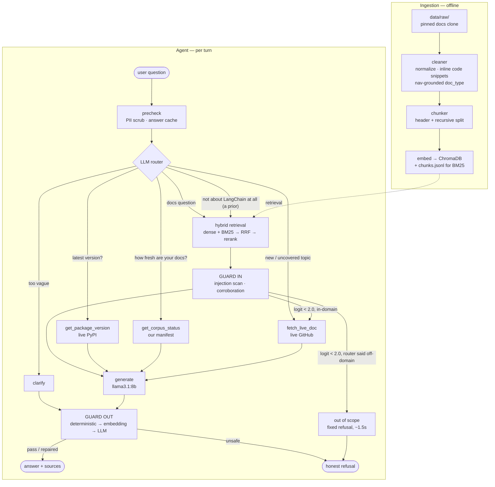

# Enterprise Support Knowledge Assistant

An **agentic RAG system** over the LangChain / LangGraph documentation — built to
demonstrate production RAG engineering, not a "chat with your docs" demo.

It routes each question to the right strategy, retrieves with a hybrid
dense + sparse pipeline, calls live tools when the frozen corpus can't answer,
and puts every generated answer through a two-stage guard layer that **repairs
what it can and refuses what it must**.

The generator is **Amazon Nova Pro on AWS Bedrock**, chosen after a measured
comparison against the local `llama3.1:8b` it was developed on (see
[Generator comparison](#generator-comparison-llama-vs-nova-pro)). Retrieval,
embeddings, reranking and the vector store are all local. A fully **offline
mode** (`LLM_PROVIDER=ollama`) is retained: it needs no cloud account and is
how the system was built and first evaluated.

---

## Demo

### 1. Agentic routing — the system picks a live tool over its own index


Two turns are visible, and they take **different paths through the graph**:

- **"what is the latest version of langchain"** → the corpus is pinned to a fixed
  commit, so retrieval *physically cannot* know today's release. The router
  recognises this and calls the `get_package_version` MCP tool, which hits the
  live PyPI API. The badges record the decision:
  `route: get_package_version` · `tool: get_package_version` · `✓ grounded` · `18.26s`.
- **"how to do the tool call in langgraph"** → a genuine documentation question,
  so this one goes to hybrid retrieval and is answered from the indexed chunks
  with a `[S2]` citation.

**Why it matters:** this is the line between a RAG pipeline and an **agent**. A
plain RAG system would confidently answer the version question from a stale
document. This one reasons about *what kind* of question it received, recognises
the boundary of its own knowledge, and reaches outside for live data.

**Also visible in this shot:**
- **Conversation history rail** (left) — every chat is listed, switchable and
  deletable, auto-named from its first message. Each conversation id *is* the
  LangGraph `thread_id`, so each keeps its own independent multi-turn memory.
- **Backend status panel** — live state of the running system: local LLM
  (`llama3.1:8b` via Ollama), the retrieval stack (hybrid + rerank, bge-small),
  corpus size (116 docs at a pinned commit), and LangSmith tracing status.
- **Per-answer badges** — route taken, tool used, guard verdict, and latency, on
  every single turn.

### 2. Inspectable retrieval — every citation is traceable


The **Sources** panel expands to show exactly which chunks the answer was built
from — each with its **file path, section heading, and cross-encoder rerank
score**, ordered by relevance:

| | source | score |
|---|---|---|
| `[S1]` | `src/oss/langchain/frontend/tool-calling.mdx` → *How tool calling works* | 7.843 |
| `[S2]` | `src/oss/langgraph/quickstart.mdx` → *Build and compile the agent* | 7.198 |
| `[S3]` | `src/oss/langgraph/event-streaming.mdx` → *Build your own projection* | 6.509 |
| `[S4]` | `src/oss/langgraph/use-functional-api.mdx` → *Review tool calls* | 5.985 |
| `[S5]` | `src/oss/langchain/middleware/custom.mdx` → *Tool call monitoring* | 5.525 |

The `[S#]` markers in the answer text map directly to these rows, so any claim
can be checked against the document it came from.

**Why it matters:** retrieval quality is **auditable rather than asserted**. You
can see whether the reranker actually surfaced relevant material, and the scores
are shown as raw rerank logits — deliberately *not* dressed up as a percentage,
because a cross-encoder logit isn't one. The badge row (`route: retrieve` ·
`✓ grounded` · `26.13s`) shows the guard layer's verdict on this specific answer.

---

## What makes it more than a RAG demo

| Capability | How |
|---|---|
| **Agentic routing** | An LLM router picks one of 6 paths: retrieve · package version · corpus status · live doc fetch · clarify · **out of scope**. The last is a *prior*, not a verdict: retrieval still runs, and confident retrieval overrules it; only when both agree is the question refused — with no generation and no judge |
| **Hybrid retrieval** | dense (bge-small + Chroma) + BM25 → Reciprocal Rank Fusion → cross-encoder rerank |
| **Real MCP tools** | A FastMCP server exposing 3 tools that return **real** data (live PyPI, our own manifest, live GitHub docs) — no mock data |
| **Knows its own limits** | The corpus is pinned to a commit, so "what's the latest version?" routes to PyPI, and out-of-scope topics escalate to a live fetch |
| **Two-stage guardrails** | Input: PII scrub, prompt-injection scan, source corroboration. Output: deterministic → embedding → LLM checks. The LLM judge (Gemini, with a Nova Lite fallback) is a **different model family from the generator** and the chain **fails closed** if both are unavailable |
| **Measured, not asserted** | Every number below comes from a committed eval harness, including 3 disjoint attack suites — 2 of them **held out**, written after the guards existed |
| **Observability + caching** | LangSmith tracing (auto region detection) and three in-process caches |

---

## Results

All measured with the committed harnesses in `eval/`. Retrieval and RAGAS
numbers were measured on the local `llama3.1:8b` generator during development;
the generator comparison and the final refusal numbers are on the deployed
Nova Pro configuration — each table says which.

### Generator comparison: llama vs Nova Pro

The system was built and first evaluated on local llama; Nova Pro was then run
through the same harnesses on the same code. Where the two are directly
comparable, Nova Pro is better, and it is what's deployed.

| measure | llama3.1:8b (local) | Amazon Nova Pro (Bedrock) | comparable? |
|---|---|---|---|
| Routing accuracy — Jaccard, 28 cases | 0.875 (24/28) | **0.964 (27/28)** | yes — same set, same code, same day |
| Out-of-scope probes routed correctly (r23–r26) | 2/4 | **4/4** | yes |
| Full-graph false refusals, 91 legit questions | 0.099 *(Phase 9 system, before the 2026-09-20 fixes)* | **0.022** *(current system)* | no — different system versions; shown as history |
| Off-topic questions refused, 9 adversarial | 9/9 | **9/9** | yes |
| Cold answer latency | ~17–26 s | **~5–7 s** | yes |
| Cost per answer | GPU electricity | fractions of a cent | — |

What was *not* re-measured on Nova: the RAGAS answer-quality and retrieval
tables below. Retrieval is generator-independent; RAGAS is not, and re-running
it on Nova is listed under future work rather than assumed.

### Retrieval — `python -m eval.run_eval` (91 questions)

| metric | dense | hybrid + rerank |
|---|---|---|
| Recall@5 | 0.868 | 0.861 |
| Hit@5 | 0.890 | 0.890 |
| MRR | 0.760 | 0.760 |

> **Honest reading:** the two are indistinguishable *on this corpus*. 116 clean,
> single-domain docs with auto-generated paraphrase-style questions is exactly
> the setting where dense alone does fine. Hybrid earns its keep on larger,
> noisier, identifier-heavy corpora — revisiting that is a tracked follow-up.

### Answer quality — `python -m eval.ragas_eval` (RAGAS, LLM-judged)

| metric | dense | hybrid + rerank | **agent (guarded)** |
|---|---|---|---|
| Faithfulness | 0.835 | 0.809 | **0.719** |
| ResponseRelevancy | 0.929 | 0.956 | **0.851** |
| ContextPrecision | 0.647 | 0.682 | **0.663** |

> The guarded agent scores *lower* on faithfulness by design: a refusal is
> "unfaithful to context" by construction, so the ~10% of questions it safely
> declines drag the mean down. Reported honestly that's **~0.79 on answered
> questions at a 0.099 refusal rate.**

### Safety — `python -m eval.eval_injections` (3 disjoint suites, 105 attacks)

| | before guards | after |
|---|---|---|
| Attack success (when the poisoned chunk was retrieved) | 0.333 | **0.040** |
| False refusals on 91 legitimate questions (llama3.1:8b, Phase 9) | 0.440 | **0.099** |
| False refusals on 91 legitimate questions (Nova Pro, full graph, after the out-of-scope + repair + regex fixes, 2026-09-20) | 0.055 | **0.022** |
| Off-topic questions refused (9 adversarial, same run) | — | **9/9**, at the router |

> **False refusals over the life of the project:** 0.440 when the guards were first
> measured → 0.099 at the end of Phase 9 (local llama) → **0.022** on the deployed
> system today (Nova Pro, full graph, all guards). Same 91 legitimate questions each time.
| Routing accuracy (Jaccard, 28 cases incl. 4 out-of-scope + 2 boundary) | — | **0.875** llama3.1:8b · **0.964** Nova Pro |

> The two 2026-09-20 rows are two full-graph runs on the deployed generator: the
> 0.055 run exposed the router refusing 4 legitimate questions on its own word
> (see problem 5 below); the 0.022 run is after the fix. The 2 remaining
> refusals are judge variance — one of them flipped between the two runs with
> no code change — not a rule that can be tuned away.
>
> Suites **B** and **C** are held out — written *after* the guards, with disjoint
> attacks, markers and probes. Suite A alone scored 0.0, which turned out to
> measure the guards against the very strings they were built from. The held-out
> suites immediately found 4 real defects, including an answer that told the user
> to paste a leaked API key into an attacker-controlled portal.
>
> **2 of 50 attacks still land.** Both are single-source misinformation — a false
> claim with no competing value anywhere in the corpus, so majority-vote
> corroboration has nothing to count. That's a threat-model boundary (the real
> fix is provenance control at ingestion), not something a regex should paper over.

---

## Architecture


```mermaid
flowchart TD
    subgraph IG["Ingestion — offline"]
        RAW["data/raw/<br/>pinned docs clone"] --> CLEAN["cleaner<br/>normalize · inline code snippets<br/>nav-grounded doc_type"]
        CLEAN --> CH["chunker<br/>header + recursive split"]
        CH --> EMB["embed → ChromaDB<br/>+ chunks.jsonl for BM25"]
    end

    subgraph AG["Agent — per turn"]
        Q(["user question"]) --> PRE["precheck<br/>PII scrub · answer cache"]
        PRE --> ROUTER{"LLM router"}
        ROUTER -->|docs question| RET["hybrid retrieval<br/>dense + BM25 → RRF → rerank"]
        ROUTER -->|"latest version?"| T1["get_package_version<br/>live PyPI"]
        ROUTER -->|"how fresh are your docs?"| T2["get_corpus_status<br/>our manifest"]
        ROUTER -->|new / uncovered topic| T3["fetch_live_doc<br/>live GitHub"]
        ROUTER -->|too vague| CLR["clarify"]
        ROUTER -->|"not about LangChain at all (a prior)"| RET

        RET --> GIN["GUARD IN<br/>injection scan · corroboration"]
        GIN -->|"logit < 2.0, in-domain"| T3
        GIN -->|"logit < 2.0, router said off-domain"| OOS["out of scope<br/>fixed refusal, ~1.5s"]
        GIN --> GEN["generate<br/>llama3.1:8b"]
        T1 --> GEN
        T2 --> GEN
        T3 --> GEN
        CLR --> GOUT
        GEN --> GOUT["GUARD OUT<br/>deterministic → embedding → LLM"]
        GOUT -->|pass / repaired| ANS(["answer + sources"])
        GOUT -->|unsafe| REF(["honest refusal"])
        OOS --> REF
    end

    EMB -.->|retrieval| RET
```

The MCP tools run in a **separate process** over stdio; the agent holds one warm
session for its lifetime.

---

## Quickstart

### Prerequisites
- Python 3.11+
- **Either** AWS credentials with Bedrock access to Nova Pro / Nova Lite
  (`aws configure`, or an IAM role on EC2) — the deployed configuration —
- **or**, for offline mode, [Ollama](https://ollama.com) with `ollama pull llama3.1:8b`
  and ~6 GB VRAM (or CPU, slower)

### 1. Install
```bash
git clone <this-repo> && cd rag_build
python -m venv env
./env/Scripts/python.exe -m pip install -r requirements.txt   # Windows
# source env/bin/activate && pip install -r requirements.txt  # macOS/Linux
```

### 2. Get the corpus
The source docs are **not vendored** (they're a 1.1 GB clone of another MIT
project). Fetch them at the pinned commit:

```bash
git clone https://github.com/langchain-ai/docs.git data/raw
cd data/raw && git checkout 22cbff9d7ad4b676db836360d98adc343f523ee1 && cd ../..
```

### 3. Configure
```bash
cp .env.example .env      # then fill in what you need
```
For a local run only `APP_PASSWORD` is required (the web UI refuses to start
without one). Everything else is optional — see `.env.example`.

### 4. Build the index
```bash
./env/Scripts/python.exe -m ingestion.cleaner.run     # data/raw  → data/cleaned
./env/Scripts/python.exe -m ingestion.run             # cleaned   → chunks.jsonl
./env/Scripts/python.exe -m ingestion.embed_and_store # chunks    → ChromaDB
```
> Re-running only reprocesses changed files. If you change the *pipeline* rather
> than the *source*, pass `--force`.

### 5. Run it
```bash
# Web UI (recommended) — opens a passcode gate first; enter APP_PASSWORD from .env
./env/Scripts/python.exe -m streamlit run app/streamlit_app.py

# or terminal chat (no gate — local use only)
./env/Scripts/python.exe -m agent.cli
```

### Choosing the LLM provider

The router, generator and clarify step all go through one factory
(`agent/llm.py`), selected by `LLM_PROVIDER` in `.env`:

| `LLM_PROVIDER` | Generator | Needs | When |
|---|---|---|---|
| `bedrock` | **Amazon Nova Pro** on AWS Bedrock (`apac.amazon.nova-pro-v1:0`) | AWS credentials via IAM role (EC2) or `aws configure`; `AWS_REGION` | **The chosen generator** — better routing, faster, no GPU needed; what the hosted demo runs |
| `ollama` | `llama3.1:8b`, local | Ollama running, ~6 GB VRAM | Offline development with no cloud account; the baseline the system was built and first evaluated on. Also the code's fallback when `LLM_PROVIDER` is unset |

```bash
# .env
LLM_PROVIDER=bedrock
AWS_REGION=ap-south-1
```

No AWS access keys go in `.env` — Bedrock auth is boto3's normal credential
chain. Model ids are region-specific: in `ap-south-1` Nova models only invoke
through the `apac.` inference profile. If Bedrock returns a
`ValidationException` in your region, override `BEDROCK_MODEL_ID` /
`BEDROCK_GUARD_MODEL_ID`. Smoke-test the switch, including the router's JSON
contract, with:

```bash
./env/Scripts/python.exe -m agent.llm bedrock
```

> **Why Nova Pro.** It was not a hosting convenience — it was measured. On the
> same routing set and the same code, Nova Pro routes 27/28 against llama's
> 24/28 and catches all four off-topic probes against llama's two; it answers
> in ~5–7 s instead of ~20 s; and it needs no GPU, which is what makes a public
> deployment possible at all. The full comparison is in
> [Results](#generator-comparison-llama-vs-nova-pro). The Ollama path is
> kept because a free, offline, no-account mode is worth having — and because
> it is the baseline every later measurement is compared against.

The guardrail judges do **not** use `LLM_PROVIDER` on purpose. A guard must be
a different model family from the generator, or it ends up grading its own
work — so the primary judge is always Gemini. Amazon Nova Lite on Bedrock is
the fallback for when Gemini is down; it shares the Nova Pro generator's
family, a known and accepted weakening on the fallback path only. If both
judges are unavailable the turn is **refused as unverifiable** rather than
shipped unchecked.
`GUARDRAIL_VERIFIER=ollama` remains as an explicit opt-in for fully-offline
development.

### Login gate and limits

The web UI is behind a single shared passcode and two cheap abuse limits, all
from `.env`:

| Variable | Default | What it does |
|---|---|---|
| `APP_PASSWORD` | *(required)* | Passcode for the login page. Empty = the app refuses to start. |
| `MAX_MESSAGES_PER_SESSION` | `20` | Messages per browser session; the input is disabled with a clear notice when hit. |
| `MAX_INPUT_CHARS` | `2000` | Longest accepted message, enforced server-side before anything reaches the LLM. |

These are session-state limits — no accounts, no Redis — which is the right
size for a passcode-gated demo, not a substitute for real auth on a
multi-tenant product.

---

## Reproducing the evaluations

```bash
./env/Scripts/python.exe -m eval.run_eval                                   # retrieval metrics
./env/Scripts/python.exe -m eval.eval_routing                               # routing accuracy
./env/Scripts/python.exe -m eval.ragas_eval                                 # RAGAS + false-refusal rate
./env/Scripts/python.exe -m eval.eval_injections --phase a --suite b        # regex coverage
./env/Scripts/python.exe -m eval.eval_injections --phase b --suite b --add  # end-to-end attacks
```
> The injection harness temporarily poisons the corpus and always purges in a
> `finally`. RAGAS needs a `GEMINI_API_KEY` (a *different* model judges, so the
> answerer can't grade itself).

---

## Project layout

```
agent/        LangGraph agent — graph, nodes, router, guards, cache, tracing
  llm.py      provider factory: LLM_PROVIDER=ollama | bedrock
  guards/     two-stage guardrails (check_input / check_output)
retrieval/    dense · sparse · RRF fusion · cross-encoder rerank
ingestion/    cleaner (MDX → Markdown) · chunker · embedder
  cleaner/    detector · normalizer · filter · manifest
mcp_server/   FastMCP server exposing the 3 real-data tools
app/          Streamlit UI + async runtime bridge
eval/         all evaluation harnesses + committed results
docs/         roadmap and phase-by-phase build notes
```

---

## Deployment

The public demo runs on **AWS EC2 in ap-south-1** (Mumbai) with **Amazon Bedrock**
as the LLM backend. The box has no GPU; the switch from local Ollama to Bedrock is
one environment variable (`LLM_PROVIDER`), with no code changes, because every
LLM call goes through the provider factory in `agent/llm.py`.

**Security posture — what is deliberately *not* on the server:**

| Concern | How it's handled |
|---|---|
| AWS credentials | **None stored anywhere.** The instance has an IAM role; boto3 resolves credentials from it at runtime. Local development uses a separate IAM user scoped to Bedrock invoke only |
| IAM permissions | Least privilege: `bedrock:InvokeModel` / `InvokeModelWithResponseStream` on the two Nova inference profiles and their foundation-model ARNs, nothing else |
| Network | Security group allows 80/443 only; SSH restricted to a single IP (or disabled in favour of Session Manager); Streamlit's port 8501 bound to localhost behind nginx with TLS |
| Application access | Single shared passcode (`APP_PASSWORD` — the app refuses to start without one), constant-time compared |
| Abuse / spend | Per-session message cap and input-length cap enforced server-side (see [Login gate and limits](#login-gate-and-limits)); AWS Budget alerts on Bedrock and EC2 spend; the instance is stopped when not being demoed |
| Secrets in git | `.env` gitignored; `.env.example` ships placeholders only; the deployment runbook is kept out of the repository |
| Release artifacts | The ChromaDB index, `chunks.jsonl` and cleaned corpus are shipped as build artifacts (byte-identical to what was evaluated), not rebuilt on the box |

The same two guards that protect answer quality also bound cost: an unverifiable
answer is refused rather than retried, and an off-topic question is refused at the
router before any generation happens.

---

## Tech stack

**LangGraph** (orchestration) · **LangChain** (retrieval utils) · **ChromaDB** ·
**bge-small-en-v1.5** (embeddings) · **rank-bm25** ·
**ms-marco-MiniLM-L-6-v2** (reranker) · **Amazon Nova Pro** on AWS Bedrock
(generator; `llama3.1:8b` via Ollama as the offline baseline) · **Gemini** (guard judge, Nova Lite fallback) ·
**MCP Python SDK** · **RAGAS** · **LangSmith** · **Streamlit**

---

## Problems hit while building — and how they were fixed

### 1. Code examples were silently disappearing from the corpus

**The problem.** The LangChain docs don't always write code inline. Many pages
keep it in separate snippet files and pull it in with an import tag that renders
as `<Component />`. The cleaner was stripping those tags as if they were
decoration — so the code they stood for never made it into the index. Ask "show
me the code for building an agent" and you'd get the surrounding prose with the
example missing.

**The fix.** The cleaner now resolves each import, fetches the snippet's real
content, and pastes it in *before* the tag-stripping step runs.

**The result.** ~259 code-bearing chunks recovered (2,052 → 2,313). Keyword
search improved sharply too — hybrid retrieval went from **0.638 → 0.760 MRR**,
because BM25 finally had real function and class names to match against.

### 2. Document type labels were nearly useless

**The problem.** Every doc gets tagged as concept / how-to / reference /
tutorial, which powers the "what do you cover?" feature. The first approach
guessed the label from the file path and writing style — and tagged **83 of 114
documents as "how-to"**. A label that says the same thing about everything tells
you nothing.

**The fix.** Stopped guessing. The documentation site already groups every page
in its own navigation file (`docs.json`), so the labels are now read from there.

**The result.** Zero unknown labels, and a coverage breakdown that reflects
reality (22 concept · 63 how-to · 13 error · 10 get-started · …).

### 3. The safety layer was rejecting good answers

**The problem.** A fact-checker verified each answer against its sources, but it
was all-or-nothing: if a *single* sentence wasn't supported, the whole answer was
thrown away and replaced with "I don't have enough information." Answers that
were 95% correct and properly cited were being binned over one stray line.
**44% of perfectly legitimate questions were being refused.**

**The fix.** Repair instead of discard — remove only the unsupported sentences
and keep the rest. Refuse outright only when too much has to be cut, or when the
content is genuinely unsafe.

**The result.** False refusals dropped from **44% → 9.9%** at the time, with no loss
in attack resistance — and to **2.2%** on the deployed system after the fixes in
problem 5 below.

### 4. "It ignores irrelevant docs" — proven, not claimed

**The problem.** It's easy to assert a RAG system won't hallucinate from junk
context. It's much harder to show it.

**The fix.** The evaluation corpus deliberately includes off-topic chunks and
poisoned documents planted to mislead the model, plus three separate suites of
prompt-injection attacks written *after* the defences existed.

**The result.** Attack success fell from **33% → 4%**, and the 2 attacks that
still get through are documented openly rather than hidden.

### 5. "Why is the sky blue?" got a confident, cited answer

**The problem.** The system was designed to refuse questions its docs don't
cover, and the eval set said it did (9/9 adversarial questions refused). Then a
plain physics question got a four-sentence answer about Rayleigh scattering,
cited to `[S1]`. The LangChain docs' *streaming example* uses the prompt "Why
is the sky blue?" and shows the streamed output `"The sky is typically
blue..."` — so the reranker scored that chunk +1.15 (above the 0.0 confidence
gate, with the other four hits at −9 to −11), the generator completed the
sentence from world knowledge, and the fact-checker saw the opening words in the
context and passed it. Three defences, one coincidence, all defeated at once.

**The fix — and the fix to the fix.** The confidence gate moved from 0.0 to
**2.0**, chosen from the measured distribution rather than by feel: legit
questions have a top logit of 4.06 at the 10th percentile, adversarial ones max
out at 0.82, so 2.0 sits in the empty band. The router gained an explicit
**`out_of_scope`** path. The first version of that path refused on the router's
word alone — and a full-graph run showed it refusing **4 of 91 legitimate
questions** (CopilotKit, the SQL tutorial's music data, TTS in the voice agent:
questions whose surface subject looks foreign but which the docs cover, all at
rerank logits of 4–8). So `out_of_scope` became a *prior*: retrieval still
runs, confident retrieval overrules the router, and the refusal fires only when
both agree. Two more defects surfaced by the same measurement were fixed
alongside: the repair step matched a multi-sentence "unsupported" claim to one
sentence and shipped the rest (this is how the sky answer survived the judge),
and the secret-disclosure regex flagged "a State **key**" and the docs' own
`getpass("Enter API key…")` as phishing — 3 more false refusals.

**The result.** Off-topic questions refuse in ~1.5s with no generation; all
four wrongly-refused questions answer again; the screenshot answer is now
stopped at three independent layers. Measured against the *judge prompt*, a
tightened variant changed zero legitimate outcomes and caught nothing extra, so
the prompt was left alone — the failure was never there.

---

